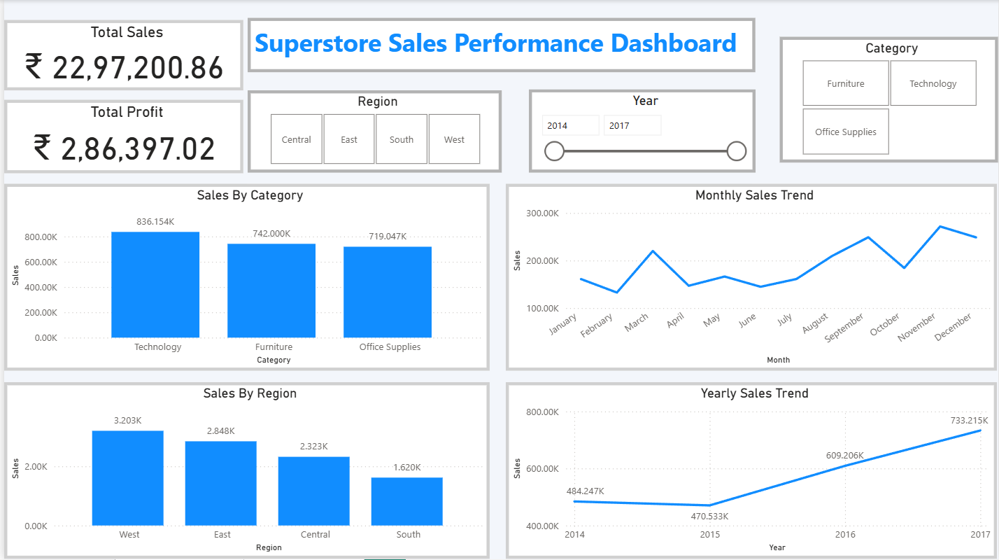
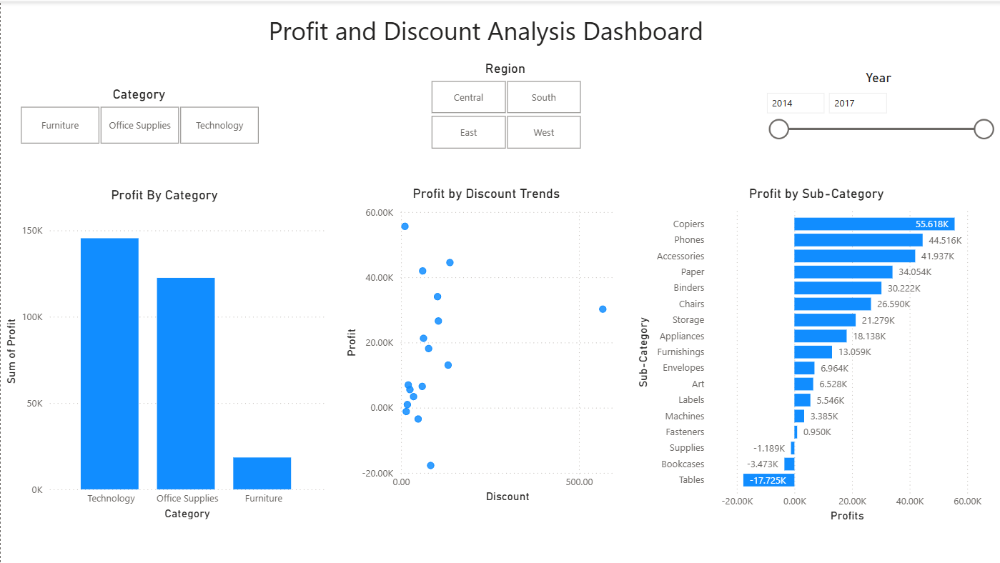

# 📊 Superstore Sales Performance Dashboard (Power BI)

## 📌 Project Overview
This project presents an interactive **Sales Performance Dashboard** built using **Power BI**, based on the Superstore dataset. The dashboard provides insights into sales, profit, regional performance, category trends, and the impact of discounts on profitability.

The goal of this project is to analyze business performance and help stakeholders make data-driven decisions using clear and interactive visualizations.

---

## 🎯 Problem Statement
Businesses need to monitor their sales performance, identify profitable and loss-making areas, and understand the impact of discounts on profit. This dashboard helps analyze key performance indicators such as total sales, total profit, category performance, regional trends, and discount effects.

---

## ❓ Key Research Questions
- What is the total sales and total profit of the business?
- Which product category generates the highest sales and profit?
- Which regions perform best and worst in terms of sales?
- How do sales trends change over months and years?
- Which sub-categories generate the most and least profit?
- How do discounts affect profitability?
- Which categories or sub-categories are causing losses?

---

## 🛠️ Tools and Technologies Used

- **Power BI Desktop** – Dashboard creation and visualization
- **Microsoft Excel** – Data source and preprocessing
- **Power Query** – Data cleaning and transformation
- **DAX (Data Analysis Expressions)** – Calculations and measures

---

## 📂 Dataset Information

Dataset includes:

- Order Date
- Sales
- Profit
- Category
- Sub-Category
- Region
- Discount
- Ship Mode
- Customer Segment

Source: Superstore Dataset (Kaggle)

---

## 📈 Dashboard Features

### Page 1: Sales Overview Dashboard

- Total Sales KPI
- Total Profit KPI
- Sales by Category (Bar Chart)
- Sales by Region (Bar Chart)
- Monthly Sales Trend (Line Chart)
- Yearly Sales Trend (Line Chart)
- Interactive slicers:
  - Category filter
  - Region filter
  - Year filter

---

### Page 2: Profit and Discount Analysis Dashboard

- Profit by Category (Bar Chart)
- Profit by Sub-Category (Bar Chart)
- Profit vs Discount Relationship (Scatter Plot)

Key insight: Higher discounts often lead to lower or negative profit.

---

## 📊 Key Insights

- Technology category generates the highest profit.
- Furniture category has lower profitability compared to other categories.
- Some sub-categories like Tables generate negative profit.
- Sales have increased steadily from 2014 to 2017.
- Excessive discounting reduces profitability.

---

## 🎛️ Interactive Features

- Dynamic filtering using slicers
- Cross-filtering between visuals
- Interactive drill-down capability
- Multi-page dashboard navigation

---

## 📷 Dashboard Preview

### Sales Overview

### Profit and Discount Analysis

---

## 🚀 How to Use

1. Download the `.pbix` file from this repository
2. Open it in Power BI Desktop
3. Use slicers to filter by Category, Region, or Year
4. Navigate between dashboard pages

---

## 📌 Project Purpose

This project was created as part of a Data Visualization training program to demonstrate:

- Business data analysis skills
- Dashboard design principles
- Power BI visualization expertise
- Insight generation from real-world data

---

## 👤 Author

**Harshit Kadam**

---

## ⭐ If you found this project useful, please give it a star!
